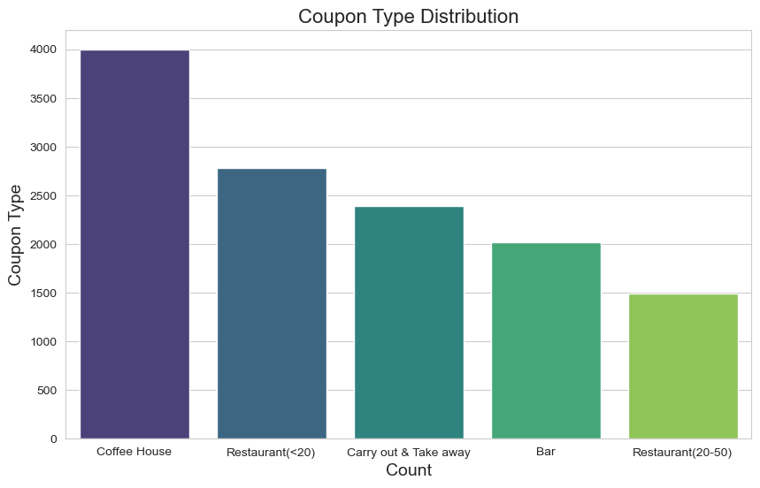
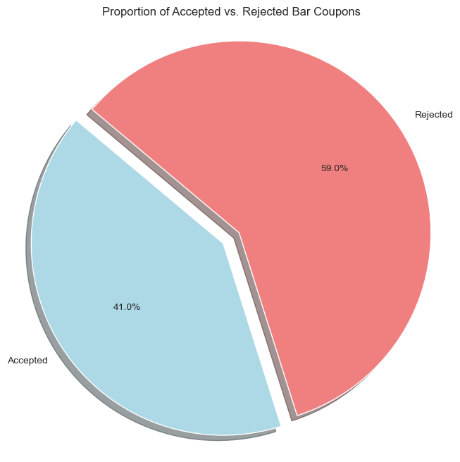
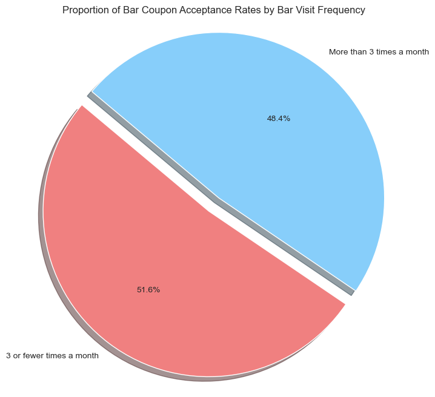
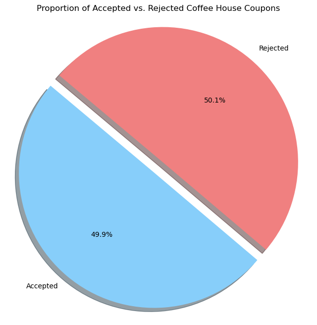
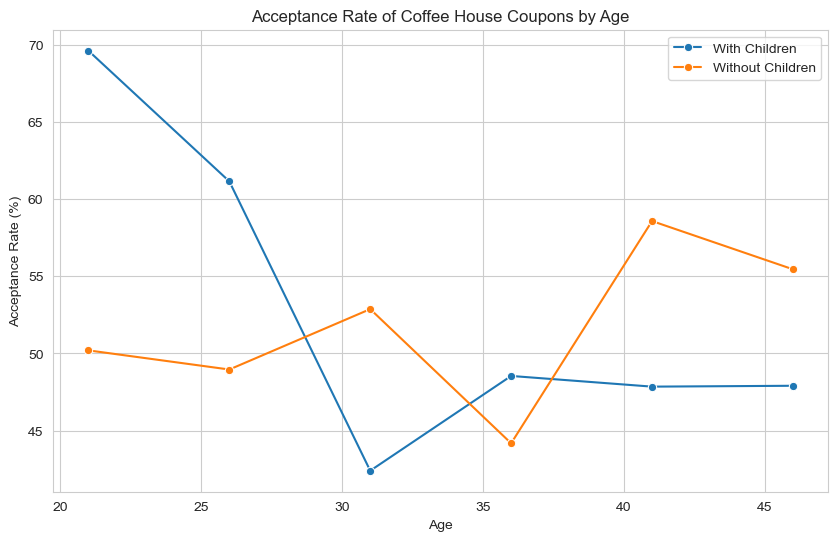

# Will a Customer Accept the Coupon?

**Context**

Imagine driving through town and a coupon is delivered to your cell phone for a restaraunt near where you are driving. Would you accept that coupon and take a short detour to the restaraunt? Would you accept the coupon but use it on a sunbsequent trip? Would you ignore the coupon entirely? What if the coupon was for a bar instead of a restaraunt? What about a coffee house? Would you accept a bar coupon with a minor passenger in the car? What about if it was just you and your partner in the car? Would weather impact the rate of acceptance? What about the time of day?

Obviously, proximity to the business is a factor on whether the coupon is delivered to the driver or not, but what are the factors that determine whether a driver accepts the coupon once it is delivered to them? How would you determine whether a driver is likely to accept a coupon?

**Overview**

The goal of this project is to use what you know about visualizations and probability distributions to distinguish between customers who accepted a driving coupon versus those that did not.

**Data**

This data comes to us from the UCI Machine Learning repository and was collected via a survey on Amazon Mechanical Turk. The survey describes different driving scenarios including the destination, current time, weather, passenger, etc., and then ask the person whether he will accept the coupon if he is the driver. Answers that the user will drive there ‘right away’ or ‘later before the coupon expires’ are labeled as ‘Y = 1’ and answers ‘no, I do not want the coupon’ are labeled as ‘Y = 0’.  There are five different types of coupons -- less expensive restaurants (under $20), coffee houses, carry out & take away, bar, and more expensive restaurants ($20 - $50).

### Data Description
Keep in mind that these values mentioned below are average values.

The attributes of this data set include:
1. User attributes
    -  Gender: male, female
    -  Age: below 21, 21 to 25, 26 to 30, etc.
    -  Marital Status: single, married partner, unmarried partner, or widowed
    -  Number of children: 0, 1, or more than 1
    -  Education: high school, bachelors degree, associates degree, or graduate degree
    -  Occupation: architecture & engineering, business & financial, etc.
    -  Annual income: less than $12500 , $12500 - $24999, $25000 - $37499, etc.
    -  Number of times that he/she goes to a bar: 0, less than 1, 1 to 3, 4 to 8 or greater than 8
    -  Number of times that he/she buys takeaway food: 0, less than 1, 1 to 3, 4 to 8 or greater
       than 8
    -  Number of times that he/she goes to a coffee house: 0, less than 1, 1 to 3, 4 to 8 or
       greater than 8
    -  Number of times that he/she eats at a restaurant with average expense less than $20 per
       person: 0, less than 1, 1 to 3, 4 to 8 or greater than 8
    -  Number of times that he/she goes to a bar: 0, less than 1, 1 to 3, 4 to 8 or greater than 8
   
2. Contextual attributes
    - Driving destination: home, work, or no urgent destination
    - Location of user, coupon and destination: we provide a map to show the geographical
      location of the user, destination, and the venue, and we mark the distance between each
      two places with time of driving. The user can see whether the venue is in the same
      direction as the destination.
    - Weather: sunny, rainy, or snowy
    - Temperature: 30F, 55F, or 80F
    - Time: 10AM, 2PM, or 6PM
    - Passenger: alone, partner, kid(s), or friend(s)

3. Coupon attributes
    - time before it expires: 2 hours or one day

## I. Initial Analysis

#### 1. What proportion of the total observations chose to accept the coupon?

Coupon acceptance rate is `56.84%`.

The accepted coupons are distributed as follows:

Coffee House coupons are the best performers, they will be further analized below.

## II. Bar coupons analysis

#### 1. What proportion of bar coupons were accepted?

41.00% of bar coupons were accepted.

#### 2. Identifying behaviour around bar attendance

**2.1 Behaviour Analysis**

The acceptance of Bar coupons is primarily influenced by driver habits.  

The acceptance rate decreases when there are more than 3 vists a month.

$\color{green}{Hypothesis}$`Bar coupon acceptance is driven by people that go to bars up to 3 times per month.` dd

Created two audiences (Low and High Frequency) based on bar attendance. The definitions are as follows:

- *Low frequency Audience: those who went to a bar 3 or fewer times a month*
- *High frequency Audience: those who went to a bar more than 3 times a month*

The majority of coupons are coming from low frequency participants.

**2.2 Takeaways on Bar Coupons

$\color{red}{Conclusion}$
**Offer more coupons to new participants and new attendies.**

## III. Coffee House coupons analysis

#### 1. What proportion of coffee house coupons were accepted?

`49.9%` of Coffee House coupons were acceptted.

#### 2. Identifying passenger profiles around coffee house attendance
**2.1 Behaviour Analysis**

The acceptance of Coffee coupons is primarily influenced by the presence of children.

The acceptance of Coffee coupons increases as the number of passengers increase.

$\color{green}{Hypothesis}$`Coffee House coupon acceptance is driven by people who have children.`

$\color{orange}{Analysis}$ Behaviour differs depending on their age and whether they have children.

For people in their 20s with children tend to grab coffee at higher frequencies than those who do not have children. 
People with children drops to it's lowest in the early 30s, where as that same age shows that people without children provides a higher percentage.
 

**2.3 Accepted Coffee Coupons, passenger types, and attendance frequency**

**2.3.2 Analyzing results**

Given the scoring system above, the analysis reports the following findings:

$\color{orange}{Analysis}$ Behaviour is consistent among all 4 passenger profiles.
Scores of 1, 2, and 6 are in the top 3 performers across the board. A score of 2 is top 1 in 3 out of 4 profiles

$\color{green}{Hypothesis}$`Attendance frequency is driving coupon acceptance
(Most likely a score of 2)`

**2.3.3 Looking deeper into the Hypothesis**

When looking at accepted coupons based on coffee house attendance frequency,
people with a score of `2` have a good chance of accepting the coupon.
But also scores of `6` are also looking good when compared to the rejected coupon behaviour.

Investigating further, people with scores of 2 and 6 represent `53.2%` of all coffee accepted coupons.

The hypothesis was in the right track but when comparing with the rejected coupons, was able to identify
that scores of 6 were also performing good. Scores of `1` where also investigated but turn out to have a
`51.8%` rejection rate. As it's shown below, scores of `2-6` represent `66.1%` of all accepted coffee coupons.

**2.4 Final thoughts on Coffee Coupons**

$\color{red}{Conclusion}$
**Offer less coupons to people that never go to coffee houses and more to people that go up to 8 times per month.**
