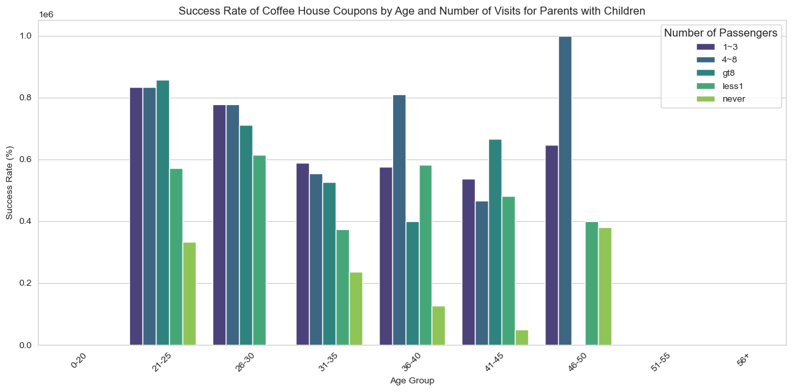
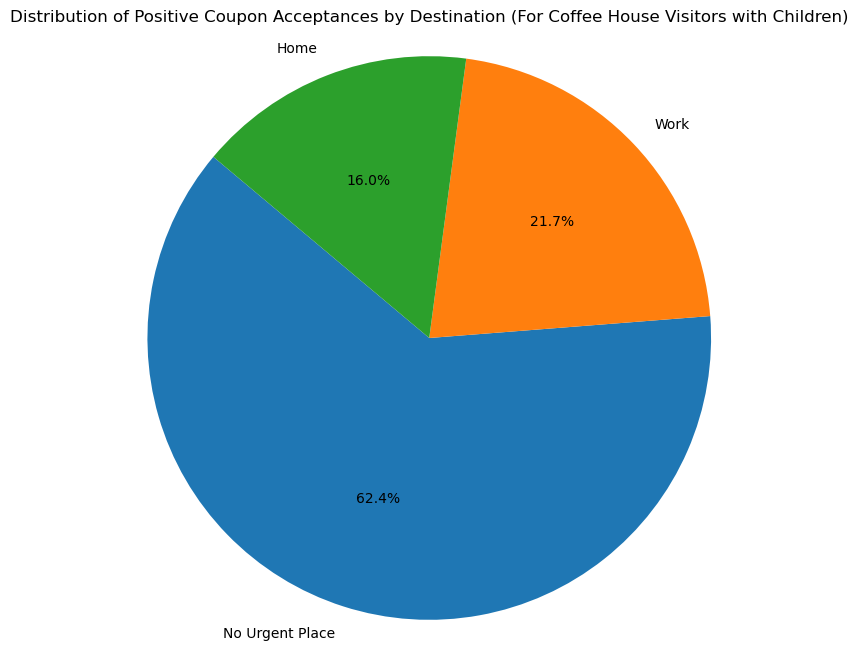

# Will a Customer Accept the Coupon?

**Context**

Imagine driving through town and a coupon is delivered to your cell phone for a restaraunt near where you are driving. Would you accept that coupon and take a short detour to the restaraunt? Would you accept the coupon but use it on a sunbsequent trip? Would you ignore the coupon entirely? What if the coupon was for a bar instead of a restaraunt? What about a coffee house? Would you accept a bar coupon with a minor passenger in the car? What about if it was just you and your partner in the car? Would weather impact the rate of acceptance? What about the time of day?

Obviously, proximity to the business is a factor on whether the coupon is delivered to the driver or not, but what are the factors that determine whether a driver accepts the coupon once it is delivered to them? How would you determine whether a driver is likely to accept a coupon?

**Overview**

The goal of this project is to use what you know about visualizations and probability distributions to distinguish between customers who accepted a driving coupon versus those that did not.

**Data**

This data comes to us from the UCI Machine Learning repository and was collected via a survey on Amazon Mechanical Turk. The survey describes different driving scenarios including the destination, current time, weather, passenger, etc., and then ask the person whether he will accept the coupon if he is the driver. Answers that the user will drive there ‘right away’ or ‘later before the coupon expires’ are labeled as ‘Y = 1’ and answers ‘no, I do not want the coupon’ are labeled as ‘Y = 0’.  There are five different types of coupons -- less expensive restaurants (under $20), coffee houses, carry out & take away, bar, and more expensive restaurants ($20 - $50).

### Data Description
Keep in mind that these values mentioned below are average values.

The attributes of this data set include:
1. User attributes
    -  Gender: male, female
    -  Age: below 21, 21 to 25, 26 to 30, etc.
    -  Marital Status: single, married partner, unmarried partner, or widowed
    -  Number of children: 0, 1, or more than 1
    -  Education: high school, bachelors degree, associates degree, or graduate degree
    -  Occupation: architecture & engineering, business & financial, etc.
    -  Annual income: less than $12500 , $12500 - $24999, $25000 - $37499, etc.
    -  Number of times that he/she goes to a bar: 0, less than 1, 1 to 3, 4 to 8 or greater than 8
    -  Number of times that he/she buys takeaway food: 0, less than 1, 1 to 3, 4 to 8 or greater
       than 8
    -  Number of times that he/she goes to a coffee house: 0, less than 1, 1 to 3, 4 to 8 or
       greater than 8
    -  Number of times that he/she eats at a restaurant with average expense less than $20 per
       person: 0, less than 1, 1 to 3, 4 to 8 or greater than 8
    -  Number of times that he/she goes to a bar: 0, less than 1, 1 to 3, 4 to 8 or greater than 8
   
2. Contextual attributes
    - Driving destination: home, work, or no urgent destination
    - Location of user, coupon and destination: we provide a map to show the geographical
      location of the user, destination, and the venue, and we mark the distance between each
      two places with time of driving. The user can see whether the venue is in the same
      direction as the destination.
    - Weather: sunny, rainy, or snowy
    - Temperature: 30F, 55F, or 80F
    - Time: 10AM, 2PM, or 6PM
    - Passenger: alone, partner, kid(s), or friend(s)

3. Coupon attributes
    - time before it expires: 2 hours or one day

## I. Initial Analysis

#### 1. What proportion of the total observations chose to accept the coupon?

The coupon acceptance rate is `56.84%`.

The accepted coupons are distributed as follows:

Coffee House coupons are the best performers, they will be further analyzed below.

## II. Bar coupons analysis

#### 1. What proportion of bar coupons were accepted?

41.00% of bar coupons were accepted.

#### 2. Identifying behavior around bar attendance

**2.1 Behaviour Analysis**

The acceptance of Bar coupons is primarily influenced by driver habits.  

The acceptance rate decreases when there are more than 3 visits a month.

$\color{green}{Hypothesis}$`Bar coupon acceptance is driven by people that go to bars up to 3 times per month.` dd

Created two audiences (Low and High Frequency) based on bar attendance. The definitions are as follows:

- * Low-frequency Audience: those who went to a bar 3 or fewer times a month*
- * High-frequency Audience: those who went to a bar more than 3 times a month*

The majority of coupons are coming from low-frequency participants.

**2.2 Takeaways on Bar Coupons

$\color{red}{Conclusion}$
**Offer more coupons to new participants and new attendees.**

## III. Coffee House coupons analysis

#### 1. What proportion of coffee house coupons were accepted?

`49.9%` of Coffee House coupons were accepted.

#### 2. Identifying passenger profiles around coffee house attendance
**2.1 Behaviour Analysis for Drivers with Children**

The acceptance of Coffee coupons is primarily influenced by the presence of children.

$\color{green}{Hypothesis}$`Coffee House coupon acceptance is driven by age and family factors.`

$\color{orange}{Analysis}$ Behaviour differs depending on their age and whether they have children.

Drivers in their 20s with children have a higher acceptance rate than those who do not have children. 

Drivers in their early 30s without children have a higher acceptance rate than those who do not have children. 

Drivers 40 and above without children have a higher acceptance rate

Drivers with children drop to their lowest in the early 30s, whereas that same age shows that people without children provide a higher percentage.

**2.2 Behaviour Analysis for Drivers with Passengers**

The acceptance of Coffee coupons is affected by passengers.

$\color{green}{Hypothesis}$`Coffee House coupon acceptance is affected by the personnel in the vehicle.`

$\color{orange}{Analysis}$ Behaviour differs depending on the number of passengers.

Drivers of every age group show a consistent top rate of acceptance for passengers ranging from 4-8.

Drivers of every age group show consistently that not having a passenger is the lowest acceptance rate.

**2.3 Accepted Coffee Coupons, passengers, and age**

**2.3.1 Analyzing results**

The analysis of Coffee House coupons reveals that approximately 49.9% of these coupons were accepted by drivers. The acceptance of Coffee House coupons appears to be  influenced by the presence of children and the number of passengers in the car. Drivers with children, particularly those in their 20s and 30s, tend to have higher acceptance rates compared to those without children. Additionally, he number of passengers plays a significant role, with drivers of all age groups exhibiting consistently higher acceptance rates when they have 4-8 passengers. This suggests that Coffee House coupon acceptance is driven by factors such as family dynamics and the social context of having passengers in the car. 

**2.3.3 Looking Deeper into the Hypothesis**

We hypothesize that Coffee House visits accompanied by children exhibit a notably high acceptance rate. This appears to be driven by social dynamics, prompting us to explore this further by examining the impact of variables such as the time of day and destination.

$\color{green}{Hypothesis}$`Coffee House coupon acceptance for groups of people tend to be recreational.`

$\color{orange}{Analysis}$Behavior varies when the destination is unrelated to work or job-related activities.

Investigating further, people with scores of 2 and 6 represent `53.2%` of all coffee accepted coupons.

The hypothesis was in the right track but when comparing with the rejected coupons, was able to identify
that scores of 6 were also performing good. Scores of `1` where also investigated but turn out to have a
`51.8%` rejection rate. As it's shown below, scores of `2-6` represent `66.1%` of all accepted coffee coupons.

**2.4 Final thoughts on Coffee Coupons**

$\color{red}{Conclusion}$
**Offer less coupons to people that never go to coffee houses and more to people that go up to 8 times per month.**
